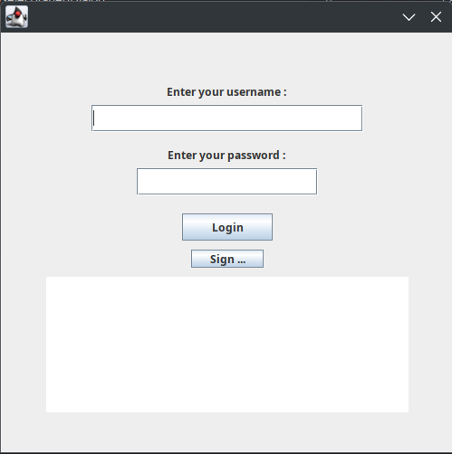
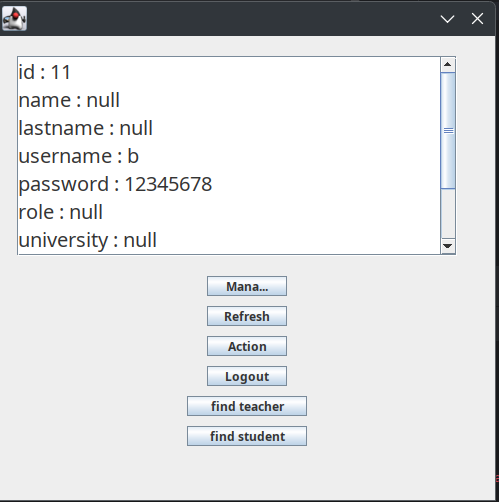
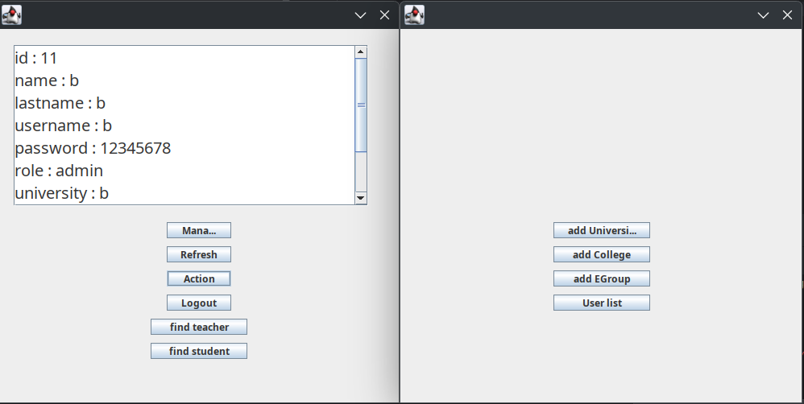
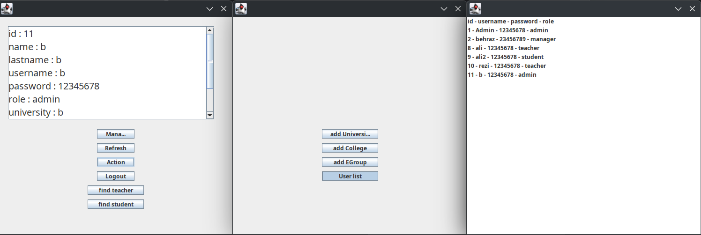

# University-Education-Management-System-Advanced-Programming-Project-3

This project is a comprehensive **university education management system** developed in Java. It simulates a real-world educational platform where multiple user roles-**admin**, **department manager**, **professor**, and **student**-can log in and interact with the system based on their access levels.

Each user type has specific capabilities within the system, ensuring a structured and role-based interaction with the platform.

## ✅ Key Features

*  **Authentication System**: Users log in with a username and password.
*  **Role-Specific Menus**: After login, users are directed to menus tailored to their role.
*  **Course Management**: Professors and managers can manage course offerings.
*  **Student Services**: Students can enroll in courses and view their schedule.
*  **Admin Tools**: Admins can oversee the entire system, manage users, and maintain control.
 
# Pictures

